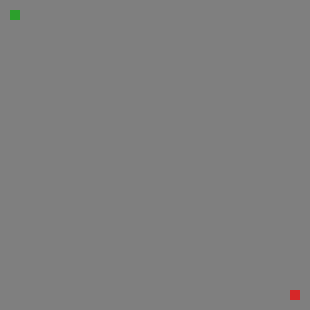
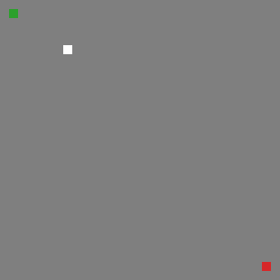
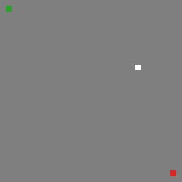
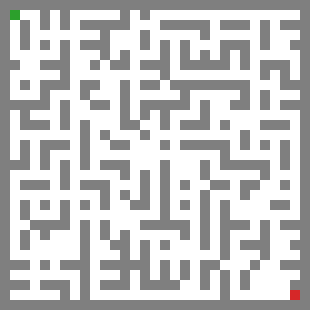

# Maze solver and generator in Rust

Learning Rust by implementing algorithms for solving and generating mazes.

## Features
- Solve mazes using various algorithms
- Generate mazes using different methods
- Visualize mazes in the terminal
- Save/Load mazes to/from files
- Save/Load mazes to/from images

## Solvers
- Depth-first search (DFS)
- Breadth-first search (BFS)
- Dijkstra
- A* search

## Generators
- Recursive backtracking
- Prim's algorithm
- Kruskal's algorithm
- Aldous-Broder algorithm

## Examples

Generate mazes with imperfect wall removal and GIF animations for both generation and solving:
```bash
cargo run --release -- \
  --width 31 --height 31 \
  --imperfect-percentage 20 \
  --generators prims,recursive_backtracker,kruskal,aldous_broder \
  --solvers astar,bfs,dfs,dijkstra \
  --generate-gifs \
  --output-dir mazes
```

To see all available CLI options and their descriptions, run:
```bash
cargo run -- --help
```

### Maze generation animations
#### Recursive Backtracker


#### Prim's algorithm


#### Kruskal's algorithm


#### Aldous-Broder algorithm


### Solver animations
#### A* search


#### Breadth-first search (BFS)


#### Depth-first search (DFS)


#### Dijkstra's algorithm

